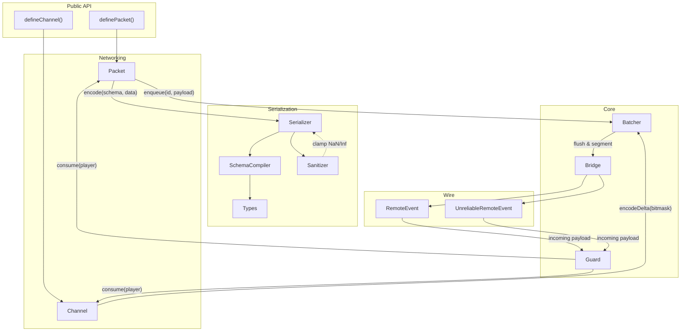

<div align="center">

# Sat·Set


</div>

**sat·set** /sat-sèt/ *adjective (slang)* — Indonesian colloquialism for being rapid, efficient, and quick to act.

> *"Sat set, sampai."* — Indonesian for "Swiftly done."

Satset is a high-performance networking library for [Roblox](https://roblox.com). It handles the heavy lifting of buffer serialization and state synchronization. It connects low-level data packing with high-level state sync, offering a unified API for both stateless events (Packets) and delta-compressed channels.

The library is built on the principle that code on the hot path should not allocate. By using native Luau `buffer` operations and focusing on O(1) operations, Satset maintains performance even when syncing hundreds of entities per frame.

# Performance Benchmarks

Satset is designed for high-throughput scenarios. We maintain a [benchmark suite](benchmark/Benchmarks.md) that measures Satset against native RemoteEvents and other common implementations.

## Dual-Mode Batching

Satset provides two batching strategies. Users can tune the library for engine stability (segmenting large payloads) or raw throughput.

| Test Case (1,000 items/frame) | Satset (Stability) | Satset (Latency) | Native Remotes |
| :--- | :--- | :--- | :--- |
| **Vectors** | 4.2 MB/s | **39.2 B/s** | 213.7 MB/s |
| **Strings** | 18.4 MB/s | **118.9 B/s** | 140.2 MB/s |
| **Booleans** | 485.4 KB/s | **38.1 B/s** | 160.9 MB/s |

> [!NOTE]
> **Payload Segmentation**: In standard use (Stability Mode), Satset segments payloads at 60KB to ensure frame-time consistency. Latency mode sends larger segments to allow better compression density when needed.

Detailed methodology and raw data can be found in the [Benchmarks Report](benchmark/Benchmarks.md).

# Documentation

Comprehensive technical documentation is available in the `docs/` directory:

- **[Architecture & Getting Started](docs/guide/getting-started.md)**: High-level overview and initialization.
- **[API Reference](docs/api/satset.md)**: Detailed breakdown of the `Satset` namespace.
- **[Development Patterns](docs/guide/development-patterns.md)**: Design principles and performance constraints.
- **[Security & Guard](docs/guide/security.md)**: Documentation on the token bucket rate limiting implementation.
- **[Serialization Types](docs/api/types.md)**: Available data types for buffer-backed schemas.

# Contributing

Contributions are welcome! Please review our **[Contribution Guide](CONTRIBUTING.md)** and **[Development Patterns](docs/guide/development-patterns.md)** before submitting a pull request.

# Features

## Hybrid Networking Engine

Satset provides two distinct communication modes:

- **Packets (Stateless)**: For one-off events like character actions or effects. These are batched automatically every frame to minimize RemoteEvent overhead.
- **Channels (Stateful)**: The core state synchronization engine. It tracks changes to a defined schema and transmits only the dirty fields (deltas) using bitmask-based compression.

## Implementation Details

- **Zero-Allocation Pipeline**: Core operations happen in pre-allocated buffers. We use a callback-based dispatch model to minimize heap allocations on the hot path.
- **Built-in Security**: Relies on Luau's native buffer bounds checks. Payload errors are caught via `pcall` to maintain stability without redundant manual checks.
- **Buffer Safety**: Dynamic data (strings/arrays) is capped relative to the physical buffer size to prevent memory-related issues.
- **Sanitized Floats**: Floating-point types (`f32`, `f64`, `Vector3`, etc.) are clamped to 0 if they are `NaN` or `±Infinity` to prevent state corruption.
- **Header Stripping**: Automatically identifies fixed-size schemas and omits size headers when possible to reduce protocol overhead.
- **MTU Management**: Automatic fragmentation for batches exceeding the [MTU](https://en.wikipedia.org/wiki/Maximum_transmission_unit) limit.
- **Guard**: Built-in server-side rate limiting using a token bucket algorithm to prevent spam.

# Architecture

The following diagram shows how data flows through Satset's internal modules, from the public API down to the wire.



For a detailed step-by-step walkthrough of a packet's lifecycle, see the [Architecture Guide](docs/guide/architecture.md).

# Usage

## Installation

Add Satset to your `wally.toml`:

```toml
Satset = "protheeuz/satset@0.3.1"
```

Then run `wally install`.

## Initialization

Satset must be started once on both the **Server** and **Client** before defining any packets or channels.

```luau
-- In your main Server/Client entry point
local ReplicatedStorage = game:GetService("ReplicatedStorage")
local Satset = require(ReplicatedStorage.Packages.Satset)
 
Satset.start({
    guard = {
        maxTokens = 60,
        refillRate = 30,
    },
    batching = {
        reliableThreshold = 60000, -- Segmentation for stability
    }
})
```

## Packets (Stateless Events)

Packets are for "fire-and-forget" events like combat hits, chat messages, or UI triggers.

**Shared Definition:**

```luau
-- ReplicatedStorage/Networking/Packets.luau
local ReplicatedStorage = game:GetService("ReplicatedStorage")
local Satset = require(ReplicatedStorage.Packages.Satset)
local Types = Satset.Types
 
return {
    Damage = Satset.definePacket({
        name = "Damage",
        schema = {
            targetId = Types.u32,
            amount = Types.u16,
            critical = Types.bool
        },
        reliable = true
    })
}
```

**Server Usage:**

```luau
local Packets = require(path.to.Shared.Packets)
 
-- Sending to specific client
Packets.Damage:fireClient(player, { targetId = 123, amount = 50, critical = true })
 
-- Listening to client events
Packets.Damage:listen(function(data, sender)
    print(sender.Name .. " dealt " .. data.amount .. " damage!")
end)
```

**Client Usage:**

```luau
local Packets = require(path.to.Shared.Packets)
 
-- Sending to server
Packets.Damage:fireServer({ targetId = 456, amount = 25, critical = false })
 
-- Listening to server events
Packets.Damage:listen(function(data)
    print("Took " .. data.amount .. " damage!")
end)
```

## Channels (Stateful Synchronization)

Channels are for data that has "state" (like health or positions). They use **delta-compression** and are much more efficient than packets for frequent updates.

**Shared Definition:**

```luau
-- ReplicatedStorage/Networking/Channels.luau
local ReplicatedStorage = game:GetService("ReplicatedStorage")
local Satset = require(ReplicatedStorage.Packages.Satset)
local Types = Satset.Types
 
return {
    PlayerState = Satset.defineChannel({
        name = "PlayerState",
        schema = {
            health = Types.u8,
            position = Types.Vector3Quantized(2048)
        },
        unreliable = true,
        resyncInterval = 5 -- Periodic keyframe to prevent drift
    })
}
```

**Server Usage:**

```luau
local Channels = require(path.to.Shared.Channels)
 
-- Create an entity instance for a player
local entity = Channels.PlayerState:create(player.UserId, {
    health = 100,
    position = Vector3.new(0, 5, 0)
})
 
-- Update state (only changed fields are transmitted)
entity:set("health", 85) 
```

**Client Usage:**

```luau
local Channels = require(path.to.Shared.Channels)
 
-- Subscribe to state changes
Channels.PlayerState:subscribe(function(entityId, state)
    print("Entity", entityId, "updated. Health:", state.health)
end)
```

# License

Satset is distributed under the terms of the [MIT License](LICENSE).

When Satset is integrated into external projects, we ask that you honor the license agreement and include Satset attribution into the user-facing product documentation.
